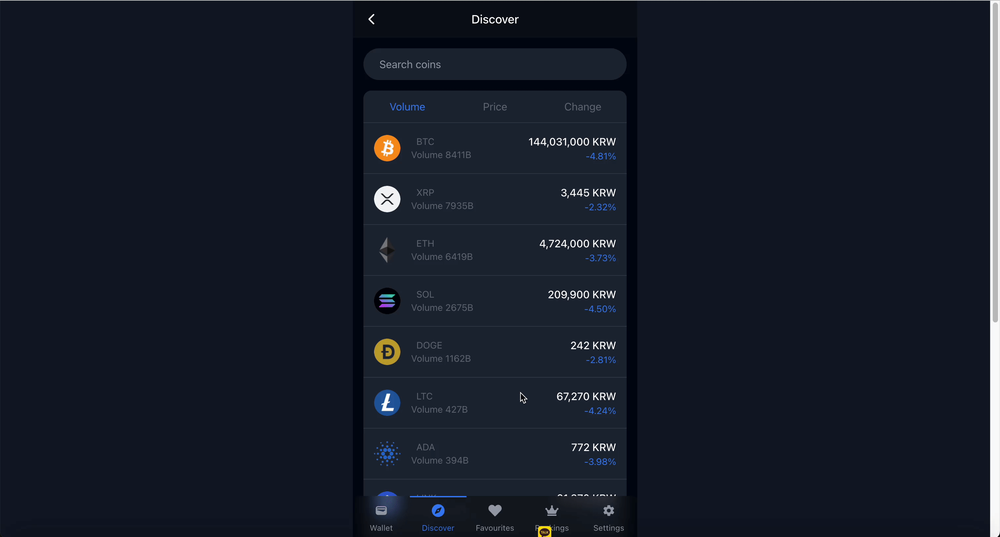
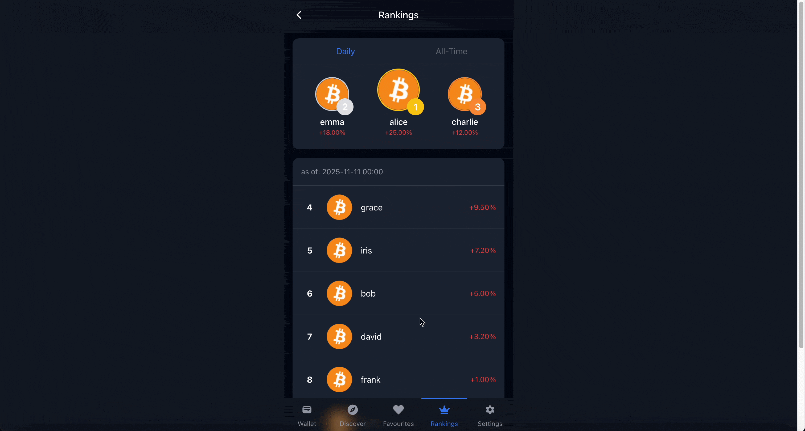
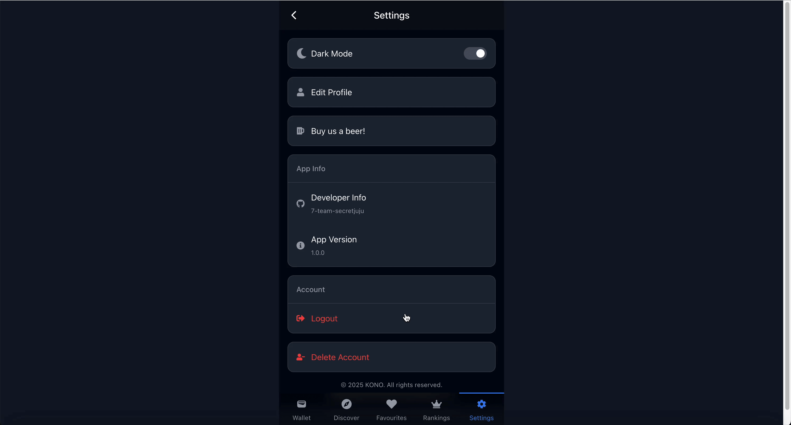

<div align="center">

# 🎮 Kono - Enterprise-Grade Crypto Trading Simulator

> **Kono is a crypto trading simulator designed for investment beginners, providing a safe environment to practise trading strategies. It delivers an educational, risk-free experience that empowers users to learn market dynamics through real-time data and interactive features.**

[](https://playkono.com/)
[](https://github.com/hyogshin/kono-client/stargazers)
[](https://github.com/hyogshin/kono-client/issues)
[](https://github.com/hyogshin/kono-client/pulls)
[](https://www.typescriptlang.org/)

**Real-time WebSocket • Microservices Architecture • AWS Cloud Infrastructure • CI/CD Pipeline**

[Live Demo](https://playkono.com/) • [Documentation](#table-of-contents) • [Issues](https://github.com/hyogshin/kono-client/issues) • [Team](#team)

---



</div>

## Table of Contents

- [About the Project](#about-the-project)
- [Key Features](#key-features)
- [Technical Highlights](#technical-highlights)
- [Architecture](#architecture)
- [Technology Stack](#technology-stack)
- [Getting Started](#getting-started)
- [Usage](#usage)
- [Team](#team)
- [Development Workflow](#development-workflow)
- [Contributing](#contributing)
- [License](#license)

## 📖 About the Project

**Kono** is a production-deployed cryptocurrency trading simulator that successfully enabled users to practise trading with £10,000 in virtual assets. Built with enterprise-grade architecture, the platform demonstrates proficiency in modern full-stack development, real-time systems, and cloud infrastructure. The platform was successfully launched in March 2025 and served real users in production until May 2025.

### Business Problem Solved

- **Risk-free learning**: Users mastered trading strategies without financial risk
- **Real market simulation**: Live price feeds from 163+ cryptocurrencies via WebSocket
- **Gamification**: Global rankings and performance tracking increased user engagement
- **Scalable architecture**: Successfully supported concurrent users with Redis caching and microservices

### Production Achievements

- **Successfully deployed to production** (31/03/2025 - 03/05/2025)
- **Sub-second latency** for real-time price updates
- **163+ cryptocurrencies** tracked in real-time via WebSocket
- **Global ranking system** with Redis-backed leaderboards
- **Live user engagement** with trading competitions and daily rankings

## ✨ Key Features

### Feature Demonstrations

<table>
  <tr>
    <th width="50%">Feature</th>
    <th width="50%">Demo</th>
  </tr>
  <tr>
    <td>
      <h4>Real-Time Market Explorer</h4>
      <p>Live price streaming for 163+ cryptocurrencies with WebSocket integration</p>
    </td>
    <td>
      
    </td>
  </tr>
  <tr>
    <td>
      <h4>Portfolio Management Dashboard</h4>
      <p>Comprehensive wallet visualisation, transaction history, and performance analytics</p>
    </td>
    <td>
      
    </td>
  </tr>
  <tr>
    <td>
      <h4>Advanced Trading System</h4>
      <p>Instant buy/sell execution with order history and real-time balance updates</p>
    </td>
    <td>
      
    </td>
  </tr>
  <tr>
    <td>
      <h4>Global Leaderboards</h4>
      <p>Redis-powered ranking system with daily and all-time performance tracking</p>
    </td>
    <td>
      
    </td>
  </tr>
  <tr>
    <td>
      <h4>User Customisation</h4>
      <p>Dark mode, i18n support (EN/KO), and personalised preferences</p>
    </td>
    <td>
      
    </td>
  </tr>
</table>

## 🚀 Technical Highlights

### Frontend Excellence

- **Type-safe development**: 100% TypeScript coverage with strict mode
- **Modern React patterns**: Hooks, Context API, custom hooks for WebSocket management
- **Performance optimisation**: Code splitting, lazy loading, memoisation
- **Responsive design**: Mobile-first approach with Tailwind CSS
- **Internationalisation**: i18n support for English and Korean markets

### Backend Architecture

- **RESTful API design**: Structured endpoints with proper HTTP semantics
- **Real-time data**: WebSocket implementation for live price feeds
- **Caching strategy**: Redis for high-performance data retrieval
- **Authentication**: OAuth2 integration with secure JWT handling
- **Rate limiting**: Protection against abuse and API throttling

### DevOps & Infrastructure

- **CI/CD Pipeline**: GitHub Actions for automated testing and deployment
- **Cloud hosting**: AWS infrastructure (EC2, RDS, ElastiCache)
- **Monitoring**: Prometheus + Grafana for observability
- **Containerisation**: Docker for consistent environments
- **Database**: MariaDB for transactional data with optimised queries

## 🏗️ Architecture

```
┌─────────────┐      ┌──────────────┐      ┌─────────────┐
│   React     │◄────►│ Spring Boot  │◄────►│   MariaDB   │
│  Frontend   │      │   Backend    │      │  Database   │
└─────────────┘      └──────────────┘      └─────────────┘
       │                     │
       │                     ▼
       │              ┌──────────────┐
       │              │    Redis     │
       │              │    Cache     │
       │              └──────────────┘
       │
       ▼
┌─────────────┐
│  WebSocket  │ ◄─── Real-time Price Updates
│   Server    │
└─────────────┘
```

**Key Design Decisions:**

- Microservices for scalability
- Event-driven architecture for real-time updates
- Stateless API for horizontal scaling
- Database optimisation with proper indexing
- Caching strategy for frequently accessed data

## 🛠️ Technology Stack

### Frontend

<div>
  
  
  
  
</div>

### Backend

<div>
  
  
  
  
</div>

### DevOps & Tools

<div>
  
  
  
  
  
</div>

## 🚦 Getting Started

### Prerequisites

Ensure you have the following installed:

- **Node.js** >= 18.0.0
- **npm** >= 9.0.0 or **yarn** >= 1.22.0
- **Git** for version control

### Installation

```bash
# Clone the repository
git clone https://github.com/hyogshin/kono-client.git
cd kono-client

# Install dependencies
npm install
# or using yarn
yarn install

# Set up environment variables
cp .env.example .env
# Edit .env with your configuration

# Start development server
npm run dev
# or
yarn dev
```

The application will be available at `http://localhost:5173`

### Environment Variables

```env
VITE_API_URL=your_backend_api_url
VITE_WS_URL=your_websocket_url
```

## 💻 Usage

### Development Commands

```bash
# Start development server with hot reload
npm run dev

# Build for production
npm run build

# Preview production build locally
npm run preview

# Run linter
npm run lint

# Run type checking
npm run type-check
```

### Key User Flows

1. **Sign up** → Receive £10,000 virtual assets
2. **Browse markets** → View real-time prices for 163+ cryptocurrencies
3. **Execute trades** → Buy/sell with instant balance updates
4. **Track portfolio** → Monitor performance and transaction history
5. **Compete globally** → Climb the leaderboards

## 👥 Team

<div align="center">
<table>
  <tr>
    <td align="center" width="150">
      <a href="https://github.com/hyogshin">
        <br/>
        <b>Hayden</b>
      </a>
      <br/>
      <sub>FE • DevOps • PM</sub>
    </td>
    <td align="center" width="150">
      <a href="https://github.com/from-minju">
        <br/>
        <b>Jenny</b>
      </a>
      <br/>
      <sub>Backend Engineer</sub>
    </td>
    <td align="center" width="150">
      <a href="https://github.com/keen1014">
        <br/>
        <b>Keen</b>
      </a>
      <br/>
      <sub>Full-stack Engineer</sub>
    </td>
    <td align="center" width="150">
      <a href="https://github.com/yosep98">
        <br/>
        <b>Sep</b>
      </a>
      <br/>
      <sub>Backend Engineer</sub>
    </td>
    <td align="center" width="150">
      <a href="https://github.com/availrum">
        <br/>
        <b>June</b>
      </a>
      <br/>
      <sub>DevOps Engineer</sub>
    </td>
  </tr>
</table>
</div>

### Individual Contributions

| Team Member | Key Responsibilities                                                                 |
| ----------- | ------------------------------------------------------------------------------------ |
| **Hayden**  | WebSocket-based real-time price collector, frontend architecture, project management |
| **Jenny**   | Ranking API development, Redis caching implementation, database optimisation         |
| **Keen**    | Buy/Sell trading logic, API integration, full-stack feature development              |
| **Sep**     | OAuth2 authentication, S3 presigned URLs, API rate limiting                          |
| **June**    | CI/CD pipeline setup, Docker containerisation, Prometheus/Grafana monitoring         |

## 📅 Development Workflow

We follow industry-standard Agile methodologies with structured sprint cycles:

### Sprint Timeline

| Sprint       | Period             | Focus                               | Key Deliverables                                                                          |
| ------------ | ------------------ | ----------------------------------- | ----------------------------------------------------------------------------------------- |
| **Planning** | 17/02 - 02/03/2025 | Service planning & technical review | Service concept, technology stack selection                                               |
| **Sprint 1** | 03/03 - 20/03/2025 | MVP development setup               | API design, ERD, architecture, GitHub/server setup, Swagger documentation, CI/CD pipeline |
| **Sprint 2** | 24/03 - 06/04/2025 | Core feature development            | MVP completion, 1st production deployment (31/03)                                         |
| **Sprint 3** | 07/04 - 20/04/2025 | Promotion & iteration               | User feedback integration, performance optimisation, feature updates                      |
| **Sprint 4** | 21/04 - 03/05/2025 | V2 release & maintenance            | Major update deployment, final optimisations, presentation prep                           |

### Development Practices

- **Agile methodology** with weekly sprints and retrospectives
- **API-first design** with complete Swagger documentation
- **100% TypeScript** coverage with strict type checking
- **Code quality tools**: ESLint + Prettier for consistency
- **Semantic versioning** with automated releases
- **Conventional commits** for clear git history
- **Pull request reviews** before merge to main
- **Automated CI/CD** testing and deployment
- **Load testing** for production readiness
- **Discord integration** for deployment notifications

## 🤝 Contributing

We welcome contributions from the community! Here's how you can help:

<details>
<summary><b>Reporting Issues</b></summary>

<br/>

- Use the [issue tracker](https://github.com/hyogshin/kono-client/issues)
- Provide clear reproduction steps
- Include environment details (OS, browser, Node.js version)
- Add screenshots or error logs if applicable

</details>

<details>
<summary><b>Submitting Pull Requests</b></summary>

<br/>

1. **Fork** the repository
2. **Create** a feature branch: `git checkout -b feat/amazing-feature`
3. **Commit** your changes: `git commit -m 'feat: add amazing feature'`
4. **Push** to the branch: `git push origin feat/amazing-feature`
5. **Open** a Pull Request with a clear description

</details>

<details>
<summary><b>Commit Convention</b></summary>

<br/>

We follow [Conventional Commits](https://www.conventionalcommits.org/):

| Type       | Description                             |
| ---------- | --------------------------------------- |
| `feat`     | New feature implementation              |
| `fix`      | Bug fix                                 |
| `docs`     | Documentation updates                   |
| `style`    | Code formatting (no logic changes)      |
| `refactor` | Code refactoring                        |
| `test`     | Adding or updating tests                |
| `chore`    | Build process or auxiliary tool changes |
| `perf`     | Performance improvements                |

</details>

## 📄 License

This project is currently in active development. All rights reserved by the Kono team.

For commercial use or collaboration inquiries, please contact the team members.

---

<div align="center">

**Built with modern technologies and best practices**

Built by the [Kono Team](#team)

[⬆ Back to Top](#-kono---enterprise-grade-crypto-trading-simulator)

</div>
